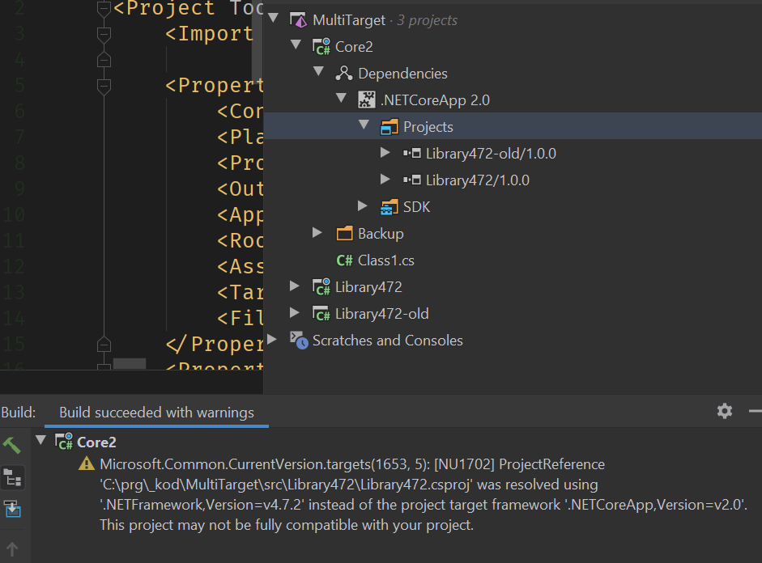
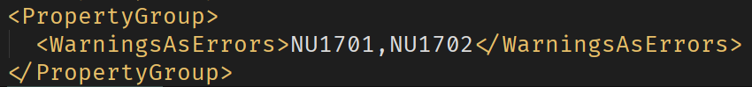
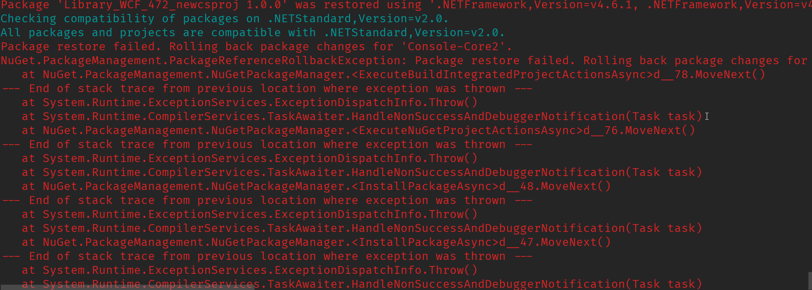
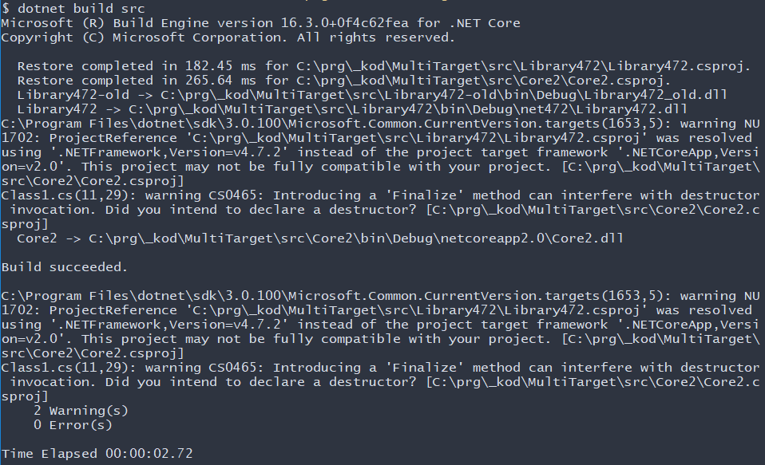
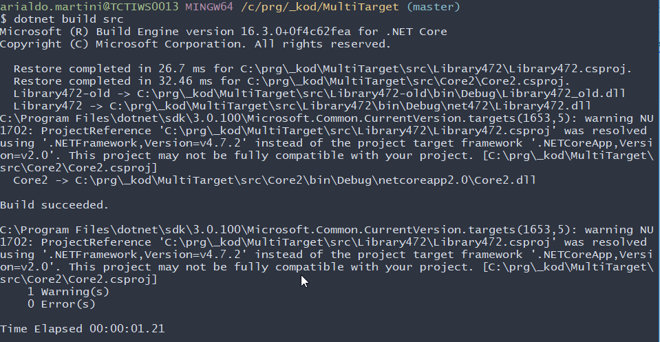

# Targets vs Runtimes

## Compilation and Execution

### CoreApp Core3

Can be built with SDK 3 and run with dotnet v3


Cannot be built with MSBuild for 4.7.2


### Console Application 4.7.2

Can be build both with Core 3 and 4.7.2


But must be run with 4.7.2. Cannot be run with Core 3


## Referencing projects

### Core App 3

Can reference a 4.7.2 library as a project!


When using the old csproj format, not even a warning is produce.

On the contrary, if using the new csproj format, the compilation produces a warning:


Core3 can run the result


### Console Application referencing a 4.7.2 Library using WCF

* Can be built both with 4.7.2 and Core 3
* Can be only run by 4.7.2
* Does not even start with Core3


### CoreApp referencing a 4.7.2 Library using WCF

* A CoreApp3 can be compiled with Core 3, but the compiler warns that the framework is not compatible and restores using 4.7.2


* If the CoreApp is v2, then the compilers restores using 4.6.1. The section [Documentation](#Documentation) provides the rational behind this behaviour.


* Notice that the warning is only emitted if the references 4.7.2 project has the new SDK csproj format.

In the solution shown below, the project `Core` is a dotcoreapp2.0, refencing 2 .NET 4.7.2 libraries: `Library472`, which uses the new SDK csproj format, and `Library472-old` which uses the previous format. Notice how the compilation warning only mentions the former library.



Also notice how the compilation failed to treat the warning `1702` as an error, despite the configuration:




# Documentation

Referencing .NET Framework 4.6.1 (and below) from .NET Core is a new feature available since .NET Core/Standard 2.0 preview 2 / VS 2017 preview 15.3.

According to MS (see [Reference .NET Framework libraries from .NET Standard](https://devblogs.microsoft.com/dotnet/announcing-net-core-2-0-preview-2/#user-content-reference-net-framework-libraries-from-net-standard)) it can be thought of as a feature that helps you migrate .NET Framework code to .NET Standard or .NET Core over time.

See [dotnet restore warning NU1701](https://stackoverflow.com/a/44999938/202443)

## Warnings as Errors
Treating the warning `NU1701` as an error is a way to enable a strict control on compatibility. To do this, add:

```xml
<PropertyGroup>
    <WarningsAsErrors>NU1701</WarningsAsErrors>
</PropertyGroup>
```

to the project file (the (SDK csproj file).

This will prevent NuGet from adding non-compatible packages:



See [How do I avoid compatibility warnings with NuGet?](https://stackoverflow.com/a/49265830/202443)


### NU1702 and Referencing assemblies as projects
When an assembly is referenced as a project, not as a NuGet package, the warning is not `NU1701` but `NU1702`.

Therefore, to enable the strict control on compatibility, the csproj should contain:


```xml
<PropertyGroup>
    <WarningsAsErrors>NU1701,NU1702</WarningsAsErrors>
</PropertyGroup>
```

but for some reasons I wasn't able to identify, the setting is just ignored.

This seems to affect other warning codes as well. See the bug report on GitHub [Cannot disable NuGet warnings with dotnet 2.0](https://github.com/NuGet/Home/issues/5769)


## Multiple compilations
Astonishingly, 2 consecutive compilations of the same project produces a different number of warnings:




Another strange behaviour is that the warnings `NU*` such as `NU1702` are just ignored by the settings:

```xml
<TreatWarningsAsErrors>True</TreatWarningsAsErrors>
```

A possible explaination is that those are NuGet warnings, differently from `CS*` warnings, which are build related: during the first build, `nuget restore` is invoked, which produces the first warning (ignored by `TreatWarningsAsErrors`, which is a MSBuild directive). During the second build, NuGet is not invoked anymore.

This would be in line with what described by @xlegalles in [this comment](https://github.com/NuGet/Home/issues/5769#issuecomment-323295261).

Finally, it seems that there are also other issues with multi-target projects (see the NuGet issue [Framework Conditioned warning properties are not respected for multi-targeting projects](https://github.com/NuGet/Home/issues/5712))
