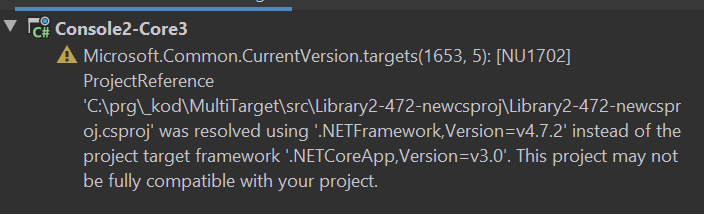

# Targets vs Runtimes

## Compilation and Execution

### CoreApp Core3

Can be built with SDK 3 and run with dotnet v3

Cannot be built with MSBuild for 4.7.2

### Console Application 4.7.2

Can be build both with Core 3 and 4.7.2

But must be run with 4.7.2. Cannot be run with Core 3

## Referencing projects

### Core App 3

Can reference a 4.7.2 library as a project!

When using the old csproj format, not even a warning is produce.

On the contrary, if using the new csproj format, the compilation produces a warning:

Core3 can run the result

### Console Application referencing a 4.7.2 Library using WCF

* Can be built both with 4.7.2 and Core 3
* Can be only run by 4.7.2
* Does not even start with Core3

### CoreApp referencing a 4.7.2 Library using WCF

* Can be compiled with Core 3, but the compiler warns that the framework is not compatible

